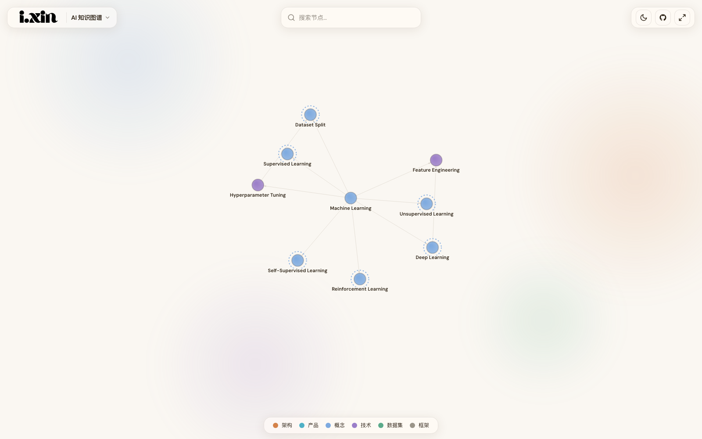

# 知识图谱 · Knowledge Graph

[](https://easin-yx.github.io/ai-knowledge-graph/)
[](https://github.com/Easin-yx/ai-knowledge-graph/actions/workflows/deploy.yml)
[](LICENSE)


一个开源的、可视化的**知识图谱模板**。以力导向图（Force-directed Graph）展示一个领域里核心概念之间的关系——并且**用 AI 维护**：改一句话指令 → push → 自动部署上线。

内置 AI、产品经理、英语语法、《黑神话：悟空》四张图谱作为示例，证明同一套架构能跨领域复用。你可以直接浏览学习，也可以 **fork 成自己领域的图谱**。

**🔗 在线 Demo：<https://easin-yx.github.io/ai-knowledge-graph/>**



> 视觉风格：iOS 液态玻璃（Liquid Glass），深色主题为主，支持深 / 浅主题切换。

## ✨ 特性

- 🕸️ **力导向图谱**：节点自由漂浮，关联越强越靠近，支持缩放与拖拽
- 🎨 **按类型着色**：概念 / 架构 / 技术 / 数据集 / 框架 五种类型对应不同色系
- 🔍 **节点详情**：点击节点查看摘要、延伸笔记、关键概念、来源与关联节点
- 🪄 **悬停高亮**：悬停节点高亮其相邻节点与关系边标签
- 📱 **完整移动端支持**：桌面端右侧滑入面板，移动端底部抽屉（可拖拽）
- 🌗 **深 / 浅主题**：一键切换，偏好持久化到 localStorage

## 🪄 把它变成你自己的图谱（fork 后只改一个文件）

本项目是一个**模板**。fork / 用 "Use this template" 创建你自己的仓库后，绝大部分「品牌身份」都集中在一个文件里：

```
src/site.config.ts
```

打开它，按注释改这几行即可——站点标题、描述、GitHub 地址、logo 文件名、主题色等都会**自动同步**到浏览器标签、SEO meta、页面右上角和 favicon：

```ts
export const siteConfig: SiteConfig = {
  repoName: "ai-knowledge-graph",          // ← 必须改成你的 GitHub 仓库名（否则线上资源 404）
  githubUrl: "https://github.com/you/...", // ← 你的仓库地址
  title: "我的知识图谱",                     // ← 站点标题
  description: "……",                       // ← SEO / 分享描述
  logo: "i.xin.svg",                       // ← public/ 下的字标（深/浅各一张）
  logoDark: "i.xin-light.svg",
  favicon: "favicon.svg",
  themeColor: "#faf7f2",
};
```

剩下两步：

1. **换 logo 资源**：替换 `public/` 下的 `i.xin.svg` / `i.xin-light.svg` / `favicon.svg` 为你自己的（或改 `site.config.ts` 里的文件名）。
2. **填你自己的内容**：见下方「如何用 AI 更新图谱数据」，把示例图谱换成你的领域。

> 提示：`docs/` 目录是原作者构建图谱的过程文档（taxonomy / 进度笔记），仅供参考，可直接删掉，不影响项目运行。

## 🚀 本地运行

需要 Node.js ≥ 18。

```bash
# 安装依赖
npm install

# 启动开发服务器（默认 http://localhost:5173/ai-knowledge-graph/）
npm run dev

# 构建生产版本
npm run build

# 本地预览生产构建
npm run preview
```

## 🧩 技术栈

| 层 | 选型 |
|---|---|
| 框架 | React 19 + TypeScript |
| 构建 | Vite 6 |
| 图谱可视化 | [react-force-graph-2d](https://github.com/vasturiano/react-force-graph) |
| 样式 | Tailwind CSS 4（Vite 插件方式） |
| 部署 | GitHub Pages + GitHub Actions |

## 🤖 如何用 AI 更新图谱数据

本项目的核心工作流是 **改数据 → push → 自动部署**。每个领域的图谱数据都是一个类型安全的文件，集中在：

```
src/data/maps/        # 每个领域一个文件，如 ai.ts / pm.ts / grammar.ts
src/data/maps/index.ts  # 在这里注册（增删）一张图谱
```

数据结构定义在 `src/types/index.ts`，因此让 AI 修改时不会引入格式错误。改完可用 `npm run validate` 校验结构。推荐的指令格式：

- `"添加节点 BERT，类型为 architecture，关联到 transformer，关系是'改进自'"`
- `"更新 self_attention 节点的 notes 字段，补充 Q/K/V 的计算细节"`
- `"添加 GPT 节点，来源是 AI 对话"`

### 节点结构速览

```ts
{
  id: "self_attention",        // snake_case 唯一标识
  label: "Self-Attention",     // Title Case 显示名
  type: "concept",             // concept | architecture | technique | dataset | framework
  details: {
    zh_label: "自注意力",        // 可选：中文名
    summary: "……",             // 必填：一句话说明
    notes: "……",               // 可选：延伸笔记
    key_concepts: ["Q/K/V"],   // 可选：关键概念
    source: { type: "paper", title: "…", url: "…" }, // 可选：来源
  },
}
```

修改后提交，GitHub Actions 会自动构建并部署：

```bash
git add src/data/maps/ai.ts
git commit -m "data: 添加 BERT 节点"
git push
```

## ⚙️ 部署到 GitHub Pages

1. 把代码推送到 GitHub 仓库，并确保 `src/site.config.ts` 里的 `repoName` 与**仓库名一致**（它决定了 Pages 的 `base` 路径，不一致会导致线上资源 404）。
2. 在仓库 **Settings → Pages → Build and deployment** 中，将 **Source** 设为 **GitHub Actions**。
3. 推送到 `main` 分支即会自动触发 [`.github/workflows/deploy.yml`](.github/workflows/deploy.yml) 完成构建与部署。
4. 站点标题、描述、GitHub 链接等都在 `src/site.config.ts` 一处配置（见上方「把它变成你自己的图谱」）。

## 📁 项目结构

```
src/
├── site.config.ts          # ⭐ 单点站点配置（fork 后主要改这里）
├── types/index.ts          # TypeScript 类型定义
├── data/maps/              # 各领域图谱数据 + index.ts 注册 ← 主要维护这里
├── constants/              # 主题色系、站点常量（转发 site.config）
├── hooks/                  # useTheme / useMediaQuery
├── components/             # Header / GraphCanvas / 详情面板 / 抽屉 / 图例
├── App.tsx                 # 组合装配与全局状态
└── main.tsx
docs/                       # 原作者构建图谱的过程文档（可删，不影响运行）
```

## 📄 License

[MIT](LICENSE)
